# BDD Requirements Challenge - Pilot Medicals

This repository contains a sample solution to the final exercise in the Serenity Dojo [BDD Requirements Discovery Training](https://expansion.serenity-dojo.com/courses/agile-requirements-discovery-blueprint) course.

https://github.com/ufarooq82/Pilot-Medicals-BDD.git

The goal of this exercise is to analyze the following user requirement, to define a set of business rules and key examples and counter-examples, 
and to write a set of executable specifications corresponding to these rules and examples.

## The Problem Domain - FAA Medical Examinations

In the Aviation industry, pilots need to have regular medical examinations to ensure that they are fit to fly. The requirements you will be analysing the FAA (Federal Aviation Administration) rules on how often these examinations must take place.

For the purposes of these rules, there are three categories of pilot licenses:
 - 1st Class (commercial airline pilots)
 - 2nd Class (other commercial pilots)
 - 3rd Class (recreational pilots)

Any pilot needs a valid medical certificate to fly. Medical certificates expire in 6 - 60 months depending on age and class:
 - 1st Class (ATP): Every 12 months if younger than age 40, Every 6 months over 40
 - 2nd Class: Every 12 months
 - 3rd Class: 2 Years if over 40, 5 years if under 40

There are also some special rules about what happens when a medical certificate expires:
  - For pilots under 40:
    - A 1st or 2nd class license drops to 3rd Class for 48 months after 12 months
  - For pilots 40 or over:
      - A 1st class license drops to 2rd Class for 6 months after 6 months
      - A 2nd class license drops to 3rd Class for 12 months after 12 months
  - A 3rd class license that expires cannot be used to fly 
  
All of the FAA validities are measured from the last day of the month.

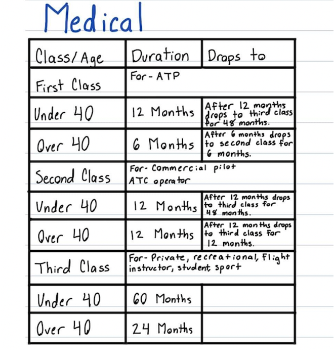

# Articles:-
https://johnfergusonsmart.com/feature-mapping-a-lightweight-requirements-discovery-practice-for-agile-teams/
https://johnfergusonsmart.com/feature-mapping-a-simpler-path-from-stories-to-executable-acceptance-criteria/

# You can see the big picture in the following diagram:

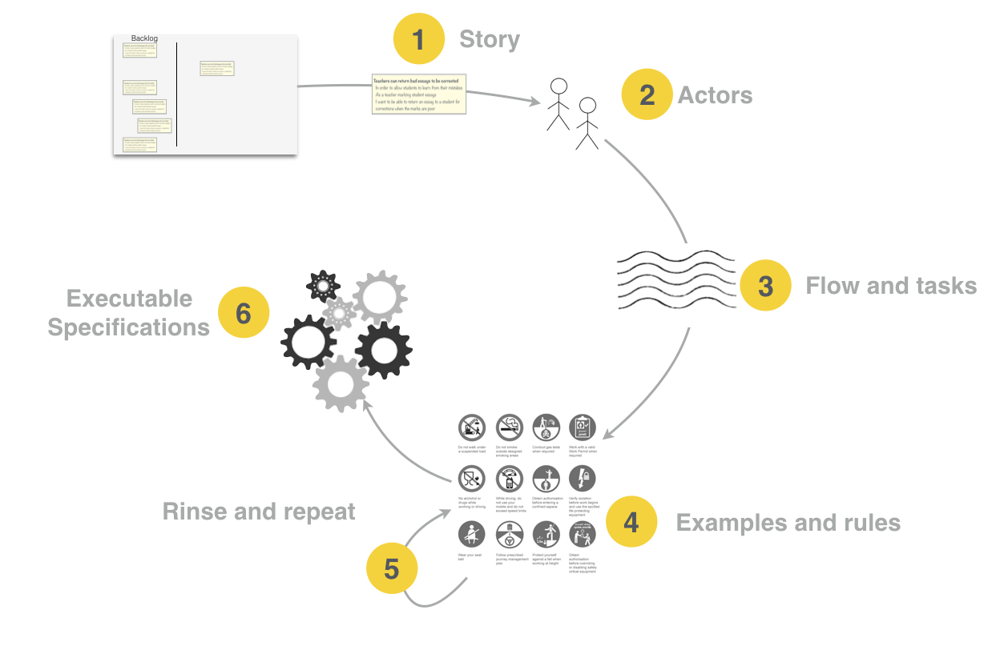
Figure 1: The Feature Mapping process^^ 

You use Feature Mapping when you need to define the acceptance criteria for a story from the backlog.
Depending on your team, it can be during or around the Sprint Planning sessions, or closer to when work on the story starts.
Feature Mapping sessions should be short and snappy. Under half an hour for a well-understood story is typical
Feature Mapping works best as a collaborative activity. Many teams use the classic Three-Amigos trio:

A BA or product owner, representing business knowledge;
A developer, representing the technical perspective;
And a tester, to make sure the requirements are testable.

BAs might write some initial acceptance criteria for the story beforehand, and that’s great. 
But these acceptance criteria can simply be one-liner business-rules, and not fully-blown Given-When-Then statements.

# 1) We start with the story

Please find attached Mural boards

Basic End to End Flow 
https://app.mural.co/t/williamhill8008/m/williamhill8008/1710082768809/9d1ea0898d085f8ce2e45ef1f5565306399cf88e?sender=u5f805037fa58e2f494b09999

Full End to End Flow
https://app.mural.co/t/williamhill8008/m/williamhill8008/1703408440912/d2a13b565374213da87dbbb9a45476c9c50f3f63?sender=u5f805037fa58e2f494b09999

A)Driving the conversation to identify the essential acceptance criteria:-

Feature Mapping starts with a feature or story, typically from your existing product backlog.

In a less ideal world, you might have a story with acceptance criteria that look like the ones we saw earlier.

I find that acceptance criteria like these tend to need a fair bit of refactoring. 

It is often easier to consider them as a starting point for discussions than as the first version of the acceptance criteria.

If a story doesn’t have any initial acceptance criteria or business rules to start with, that’s fine too. You will discover them during the Feature Mapping exercise.

As a rule, good acceptance criteria avoid mentioning user interfaces, field formats, buttons and so on. Mockups or wireframes are a much better place to document these requirements.

IN ORDER to comply with FAA rules  
( Why , IMP < Deliver Business Value>)

AS A Pilot
( Who , < Benefiting Stakeholder > )

I WANT to have regular medical examinations so that pilots fit to fly
( What < Some feature or capability > )

# 2) After describe out stories, need to a few high level AC to go with user stories
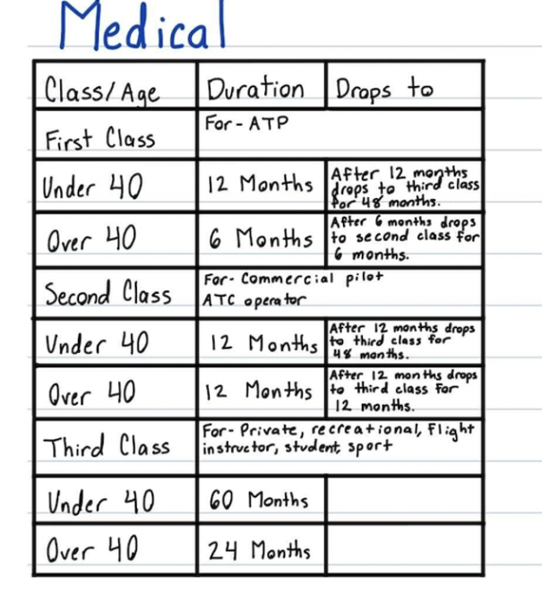

# 3 We understand the actors

Actor / Personas:-
Mike is 1st class pilot age 25
Stan is 2nd class pilot age30
Browyn is 1st class pilot age 41
Silvia is second class pilot age 45
Adam is 3rd class pilot age 29
Adama is 3rd class pilot age 50

# 4 We break the feature into tasks or steps
Figure 2: We break a story into tasks or steps
When we lay them out horizontally, we get something like this:
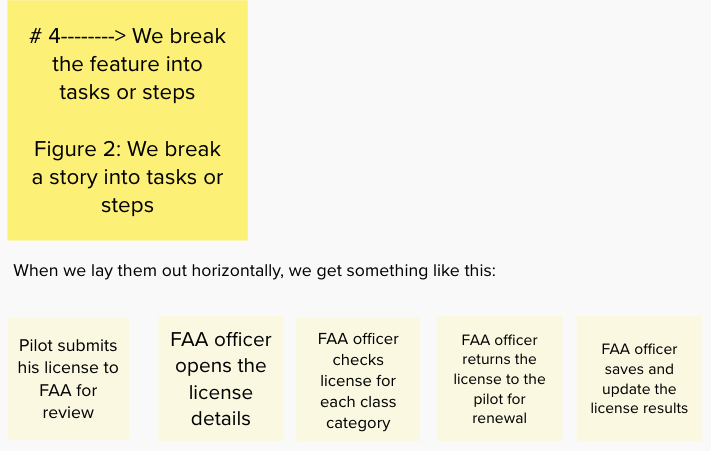

 # 5 Examples, Rules and Questions
 # Finding examples
Once we have an idea of the tasks or steps involved in achieving the story goal, we talk through concrete examples of these steps.
Each example illustrates a different flow through the steps.
For our first example, we explore what happens when Mike submits a valid license:

- Mike is first class pilot younger then 40 with valid license, so his license is saved and result updated as valid

If we map this out into the various tasks we identified earlier, we would get something like this:

Figure 3: Mapping examples ^^

This example might be called a "happy path", but we don't stop here. We look for other examples that illustrate different flows through the story. At each step or task, we can ask questions like: "what else could happen here?" and "what other inputs would change the outcomes?"

For example, what happens if Mike submits expired license? We could write another example, like the following:

- Mike license is expired and returned to apply for renewal

If we map this on our feature map, we might get something like this:

Adding a counter-example

Figure 4: ^^^

 # 6Examples and Consequences

Sometimes the map reads more clearly if you have a consequence for each example row.

This is especially good for examples that involve calculations.

Sometimes you want to record the consequences for each example more explicitly.

In this Feature Map, we add a special Consequence column that contains the consequence of each example row. 

If you have a lot of consequences that you want to express explicitly, a consequence column can make the map easier to read.

# a) @First-Class-Pilots-Rules-Journey-Scenarios figure 

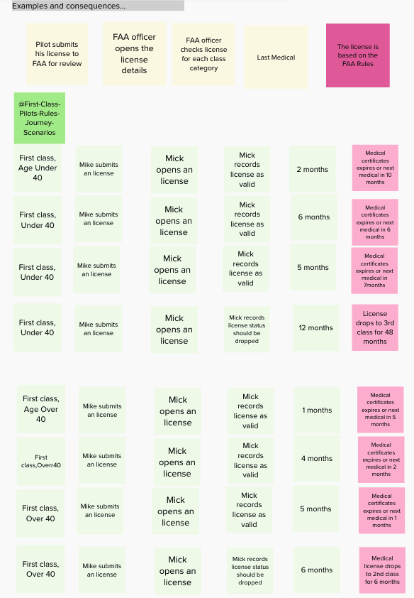

# b) @Second-Class-Pilots-Rules-Journey-Scenarios figure

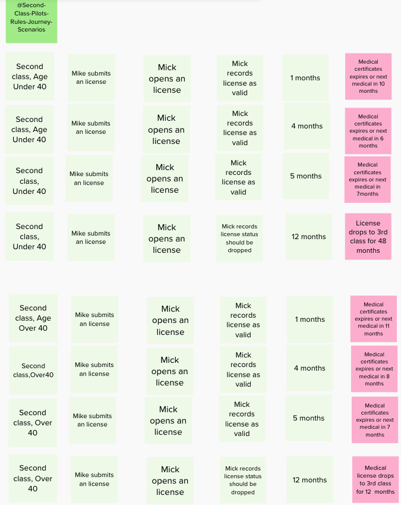

# c) @Third-Class-Pilots-Rules-Journey-Scenarios figure

# 7 Rules explain the examples, examples illustrate the rules

This lets us explore the scenarios in two dimensions. 

If we already have an idea of the rules (or some of the rules), we can take a rule and walk through some concrete examples that illustrate this rule. 

This helps us explore our understanding of the rules by looking for examples and counter-examples. 

Or we can continue to work through examples ("what else could happen in this task? How would that affect the outcome"), 

and add rules to explain the new examples as we need them.

We don't need rules for all the scenarios. 

Many scenarios illustrate the overall flow of a feature, so the rule is simply the goal of the feature. 

If our application allowed a teacher to return an essay to a student no matter what the mark, the "Can return an essay if any mark is 6 or less" would be unnecessary. 

In this case, we wouldn't need a rule card for the right-most column. 

Rather, the overall goal of the feature ("the teacher should be able to return an essay to a student for corrections when the marks are poor") could act as an implicit rule.

# a) @First-Class-Pilots-Rules-Journey-Scenarios figure

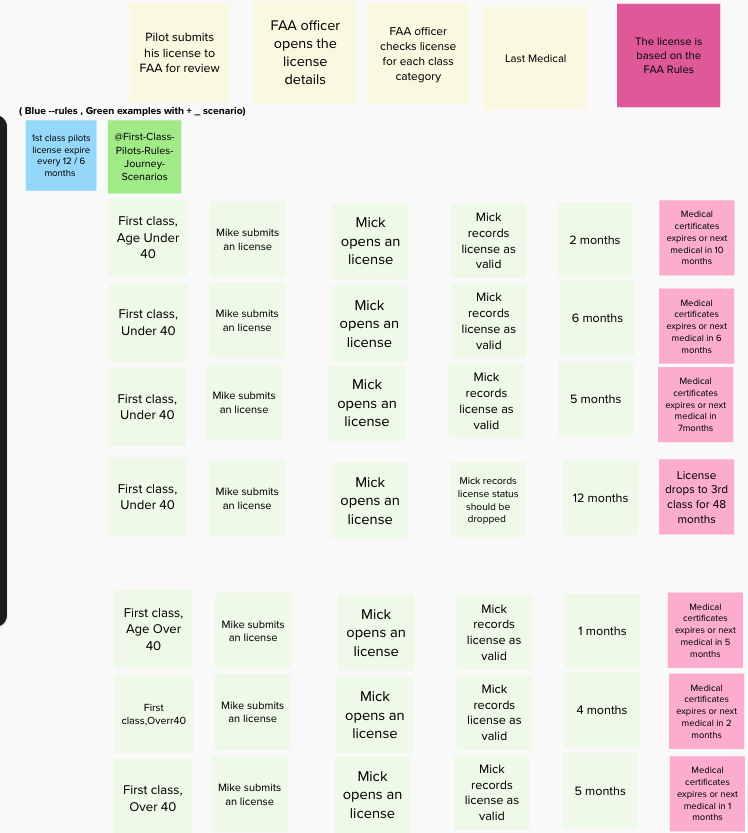

# b) @Second-Class-Pilots-Rules-Journey-Scenarios figure

# c) @Third-Class-Pilots-Rules-Journey-Scenarios figure

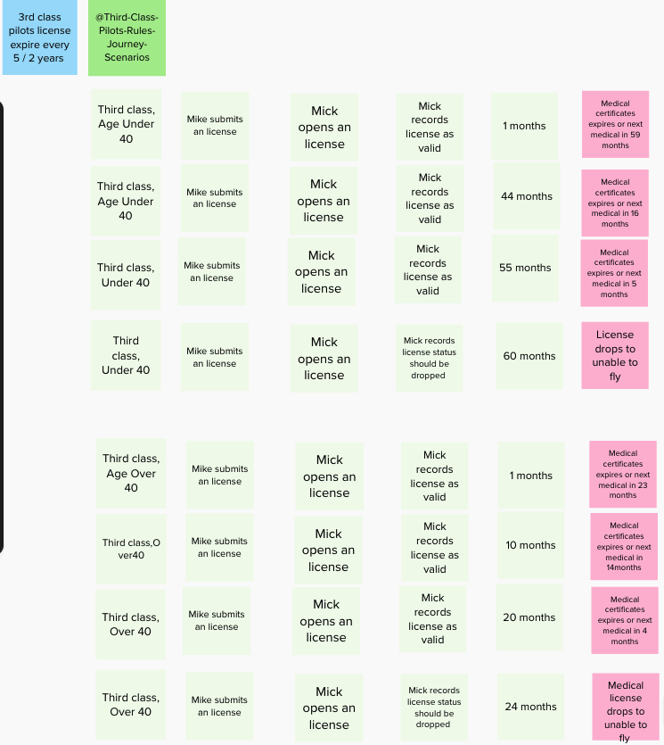

# 8 Questions highlight uncertainty 

The third element of Example Mapping comes into play when you discover something that no one knows. 

Suppose you know that some subjects marked on a scale of 1 to 10, whereas others from 0 to 10. 

The BA is aware of this rule, but doesn’t know what subjects it relates to, or whether it is in scope for this story.

So she writes it down on a Question card (a pink one, using the Examples Mapping conventions). 

I like to place these cards under the step they relate to, to give them some context and help identify complexity. 

A step or task with a lot of questions indicates a lot of uncertainty, and might need refactoring into a story of it’s own

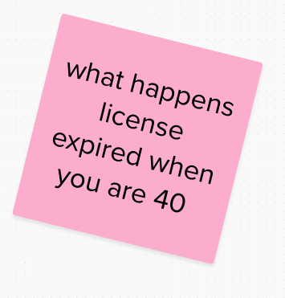

# 9 Working with negative cases 

The examples we've seen so far could be described as "happy-day cases", smooth flows through the story.

But our acceptance criteria should also describe negative scenarios, especially if they are important to the business. 

Negative scenarios help understand the positive scenarios better, and help flush out incorrect assumptions or missing details.

Acceptance criteria should record both positive and negative scenarios. 

However, not all negative scenarios are useful. Field validation rules are fine if the rules relate to business requirements. 

But a scenario checking for badly-formatted dates or numbers would normally be reserved for unit testing.

The new example could be mapped out like this:

# a) NegativeCases@First-Class-Pilots-Rules-Journey-Scenarios

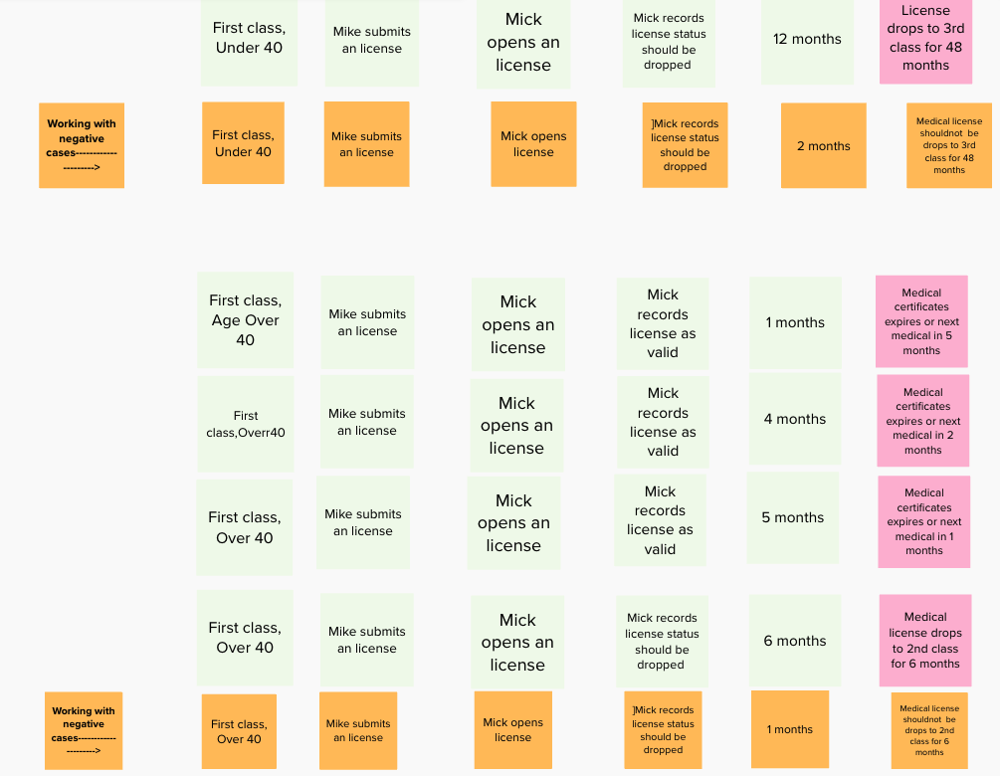

# b) NegativeCases@Second-Class-Pilots-Rules-Journey-Scenarios

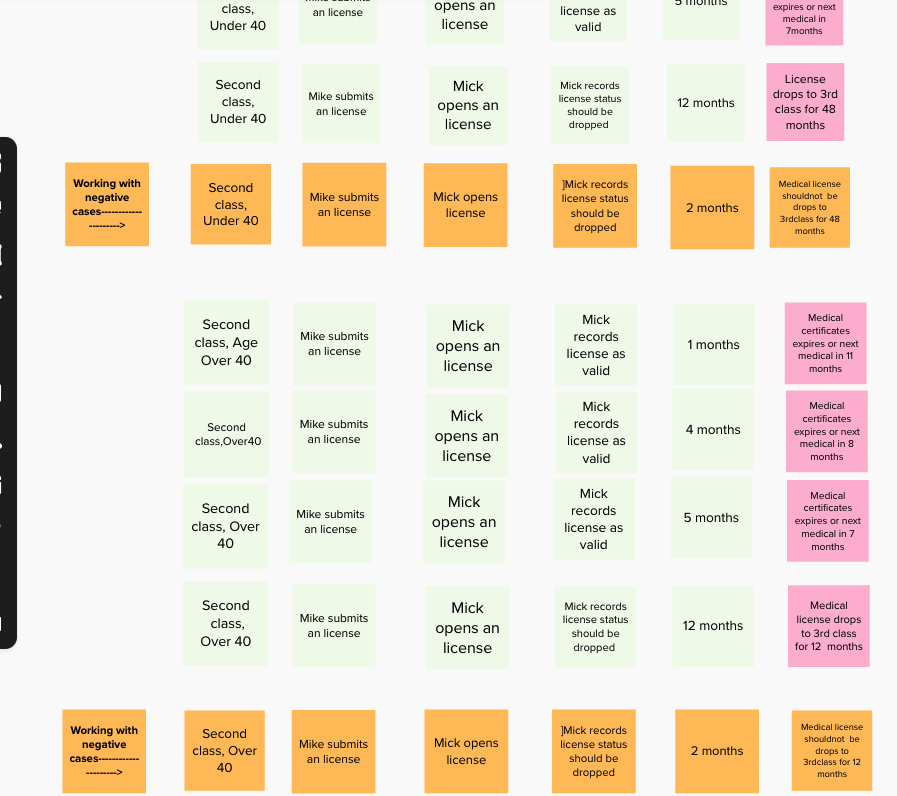

# c) NegativeCases@Third-Class-Pilots-Rules-Journey-Scenarios

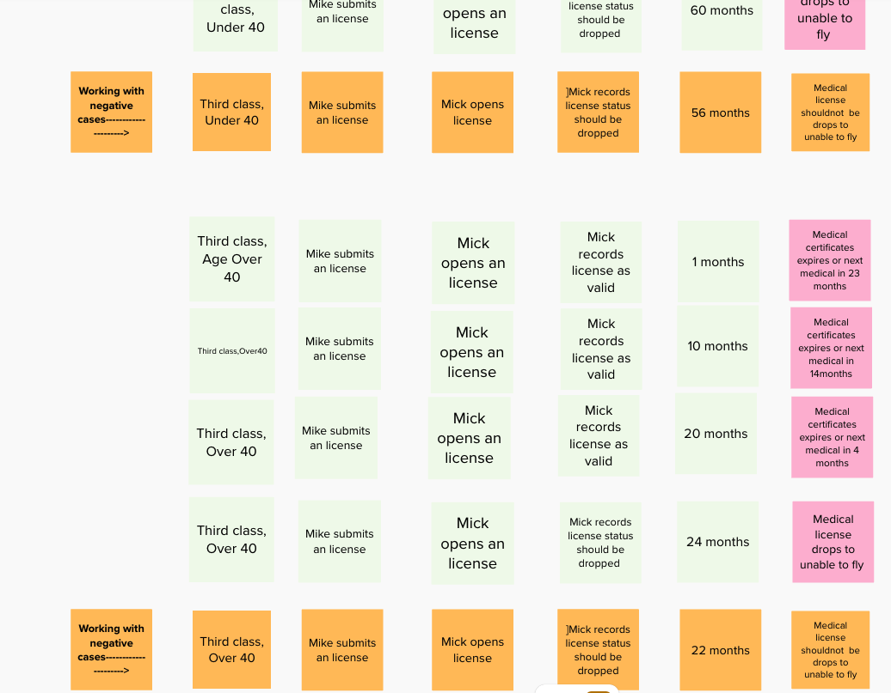

# 9.1) #Counter-examples complete the picture ^^^^

# 9.2) Let’s look at another requirement

Let’s look at another requirement. Suppose, after some investigation
To illustrate this rule properly, we really need two examples:

We could add all of these examples to the feature map as shown here:

# a) Please check  README.MD file for Figure for Representing negative scenarios@Third-Class-Pilots-Rules-Journey-Scenarios

# b) Please check  README.MD file for Figure for Representing negative scenarios@Third-Class-Pilots-Rules-Journey-Scenarios

## The Exercise Summary

The aim of this exercise was to two-fold:
 - Created an Example Map identified the key rules, examples and counter-examples in this domain.
 - Defined BDD scenarios for these rules and examples

## Full course BDD with Screenshoot
https://miro.com/app/board/uXjVNIL1_l8=/

